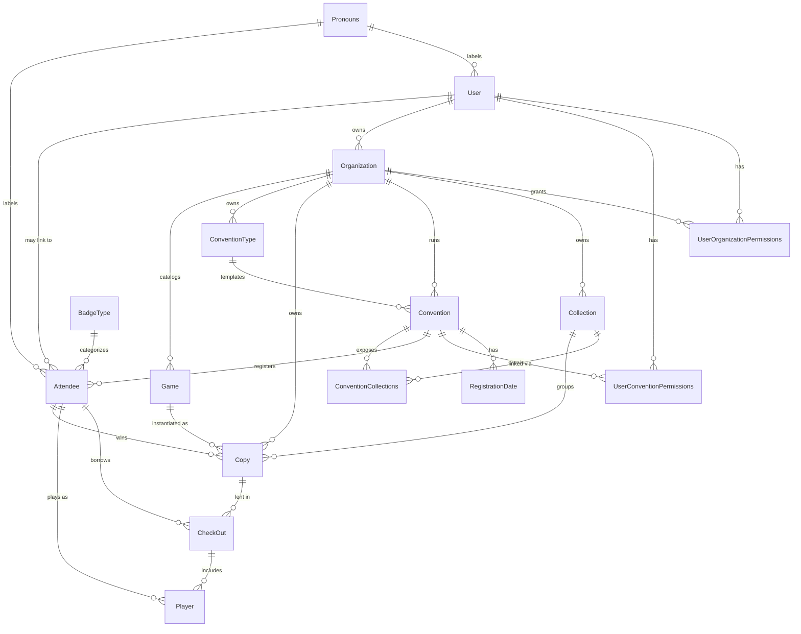

# Database

The backend uses **PostgreSQL**, accessed through **Prisma**. The schema of
record is [`prisma/schema.prisma`](../prisma/schema.prisma); this document is a
human-readable companion to it.

## Domain overview

This is a board-game library and convention-management system. At the top of the
hierarchy is an **Organization**, the tenant that owns everything else:

- It runs **Conventions** (events), each built from a **ConventionType** (a
  reusable branding/template profile) and bounded by **RegistrationDate**
  windows.
- It maintains a game library: **Game** titles (catalog metadata, optionally
  synced from BoardGameGeek) and their physical **Copy** instances, grouped into
  **Collections**.
- People who attend an event are **Attendees** (convention-scoped, optionally
  linked to a **User** account). Attendees borrow copies via **CheckOut**
  records, and each participant in a session is a **Player** who can rate the
  game and opt in to win the copy.

Access control is scoped, not global: a **User** is granted role flags per
organization (**UserOrganizationPermissions**) and per convention
(**UserConventionPermissions**). The only global role is `User.superAdmin`.

## Entity relationship diagram

## Models

### User
An application account. Logs in to manage organizations and conventions; access
is scoped through the permission join tables rather than a single global role
(except `superAdmin`).

| Field | Type | Notes |
|---|---|---|
| id | Int | PK |
| email | String | unique |
| name | String? | |
| username | String? | unique |
| superAdmin | Boolean | platform-wide admin, bypasses scoped checks (default `false`) |
| pronounsId | Int? | → Pronouns |
| organizations | Organization[] | organizations this user owns |

### Attendee
A person registered for a specific convention. Convention-scoped: the same real
person at two conventions has two Attendee rows. Optionally linked to a User.
Badge identity syncs with Tabletop.Events (`tte*` fields).

| Field | Type | Notes |
|---|---|---|
| id | Int | PK |
| conventionId | Int | → Convention |
| badgeName | String | name printed on the badge |
| badgeFirstName / badgeLastName | String | |
| legalName | String | |
| userId | Int? | optional → User |
| badgeNumber | String | unique within convention |
| barcode | String | scannable; unique within convention |
| badgeTypeId | Int? | → BadgeType |
| tteBadgeNumber | Int? | external Tabletop.Events badge number (unique within convention) |
| tteBadgeId | String? | external Tabletop.Events badge id |
| email | String? | |
| pronounsId | Int? | → Pronouns |
| checkedIn | Boolean | arrived at convention (default `false`) |
| printed | Boolean | physical badge printed (default `false`) |
| registrationCode | String? | |
| merch | String? | |
| eligibleForPrizes | Boolean | eligible for prize drawings (default `true`) |
| lostBadge | Boolean | default `false` |

Unique: `(conventionId, badgeNumber)`, `(conventionId, barcode)`, `(conventionId, tteBadgeNumber)`.

### BadgeType
A category of badge (e.g. attendee, exhibitor, staff). `name` is unique.

### Pronouns
A reusable set of pronouns selectable by users and attendees. `pronouns` is unique.

### UserOrganizationPermissions
Role flags granting a User access within an Organization. One row per
`(user, organization)` pair.

| Field | Type | Notes |
|---|---|---|
| userId | Int | → User |
| organizationId | Int | → Organization |
| admin | Boolean | full control of the organization |
| geekGuide | Boolean | staff/volunteer role |
| readOnly | Boolean | view-only access |

Unique: `(userId, organizationId)`.

### UserConventionPermissions
Role flags granting a User access within a single Convention. One row per
`(user, convention)` pair.

| Field | Type | Notes |
|---|---|---|
| userId | Int | → User |
| conventionId | Int | → Convention |
| admin | Boolean | full control of the convention |
| geekGuide | Boolean | staff/volunteer role |
| attendee | Boolean | standard attendee-level access |

Unique: `(userId, conventionId)`.

### Organization
The top-level tenant. Owns conventions, collections, copies, convention types,
and the game catalog. `name` is unique.

| Field | Type | Notes |
|---|---|---|
| ownerId | Int | → User (the owner) |
| users | UserOrganizationPermissions[] | |
| collections, conventions, copies, conventionType, games | relations | owned data |

### ConventionType
A template/branding profile for conventions. Logos are stored as `Bytes` in the
database.

| Field | Type | Notes |
|---|---|---|
| name | String | |
| description | String? | |
| logo / logoSquare | Bytes? | image bytes stored in DB |
| icon | String? | |
| content | String? | |
| organizationId | Int | → Organization |

Unique: `(name, organizationId)`.

### RegistrationDate
A named registration window for a convention (e.g. "Early Bird"), bounded by
`startDate`/`endDate`.

| Field | Type | Notes |
|---|---|---|
| conventionId | Int | → Convention |
| name | String | |
| startDate / endDate | DateTime | |

### Collection
A named grouping of game copies within an organization (e.g. "Main Library",
"Prize Pool"). Linked to conventions via ConventionCollections.

| Field | Type | Notes |
|---|---|---|
| name | String | |
| organizationId | Int | → Organization |
| public | Boolean | visible publicly (default `false`) |
| allowWinning | Boolean | copies may be won as prizes (default `false`) |
| archived | Boolean | default `false` |

Unique: `(organizationId, name)`.

### Game
A board-game title (catalog metadata), distinct from a physical Copy. Metadata
can be synced from BoardGameGeek via `bggId`. `name` is unique.

| Field | Type | Notes |
|---|---|---|
| organizationId | Int | → Organization |
| bggId | Int? | BoardGameGeek game id |
| lastBGGSync | DateTime? | last successful BGG sync |
| shortDescription / longDescription | String? | |
| designer / artist / publisher | String? | |
| minPlayers / maxPlayers | Int? | |
| minTime / maxTime | Int? | play time in minutes |
| minAge | Int? | |
| weight | Decimal? | BGG complexity rating |
| coverArt | Bytes? | image bytes stored in DB |
| yearPublished | Int? | |

### Copy
A physical, lendable instance of a Game. Barcodes are unique within both the
owning collection and the organization.

| Field | Type | Notes |
|---|---|---|
| gameId | Int | → Game |
| dateAdded | DateTime | |
| barcodeLabel | String | human-readable sticker label |
| barcode | String | scannable value |
| dateRetired | DateTime? | set when removed from circulation |
| comments | String? | |
| winnable | Boolean | available to be won (default `true`) |
| winnerId | Int? | → Attendee; `onDelete: Restrict` |
| coverArtOverride | Bytes? | per-copy art overriding the game default |
| collectionId | Int | → Collection |
| organizationId | Int | → Organization |

Unique: `(collectionId, barcode)`, `(collectionId, barcodeLabel)`, `(organizationId, barcode)`, `(organizationId, barcodeLabel)`.

### CheckOut
A library lending event: an attendee borrows a copy. An open checkout has a null
`checkIn`; the copy is returned when `checkIn` is set.

| Field | Type | Notes |
|---|---|---|
| attendeeId | Int | → Attendee (borrower) |
| checkOut | DateTime | |
| checkIn | DateTime? | null while still out |
| copyId | Int? | → Copy; `onDelete: Restrict` |
| submitted | Boolean | ratings submitted (default `false`) |

### Player
One attendee's participation in a CheckOut (a game session).

| Field | Type | Notes |
|---|---|---|
| checkOutId | Int | → CheckOut |
| attendeeId | Int | → Attendee |
| rating | Int? | this player's rating of the game |
| wantToWin | Boolean | entered to win this copy |

### Convention
A specific event run by an organization, with dates, branding, registration
windows, and the game collections available at it.

| Field | Type | Notes |
|---|---|---|
| organizationId | Int | → Organization |
| name | String | |
| theme | String | default `""` |
| logo / logoSquare | Bytes | image bytes, default `""` |
| icon | String | default `""` |
| startDate / endDate | DateTime | |
| registrationUrl | String? | default `""` |
| typeId | Int | → ConventionType |
| annual | String | annual/edition label, default `""` |
| size | Int? | expected/actual attendance |
| cancelled | Boolean | default `false` |
| tteConventionId | String? | external Tabletop.Events convention id |

Unique: `(name, organizationId)`.

### ConventionCollections
Join table linking a Convention to the Collections of game copies available at
it (many-to-many).

| Field | Type | Notes |
|---|---|---|
| conventionId | Int | → Convention |
| collectionId | Int | → Collection |

Unique: `(conventionId, collectionId)`.

## Notes

- **Images** (`logo`, `logoSquare`, `coverArt`, `coverArtOverride`) are stored
  as `Bytes` directly in the database rather than as external object-storage
  references.
- **External sync**: badge and convention identities can be sourced from
  Tabletop.Events (`tte*` fields); game metadata can be synced from
  BoardGameGeek (`bggId`, `lastBGGSync`).
- **Restrict deletes**: `Copy.winner` and `CheckOut.copy` use `onDelete:
  Restrict` so an attendee with a recorded win, or a copy with checkout history,
  cannot be deleted out from under those records.
